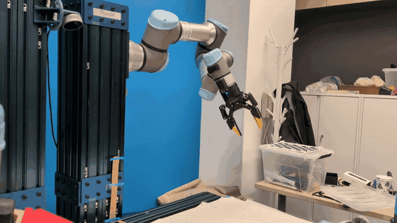
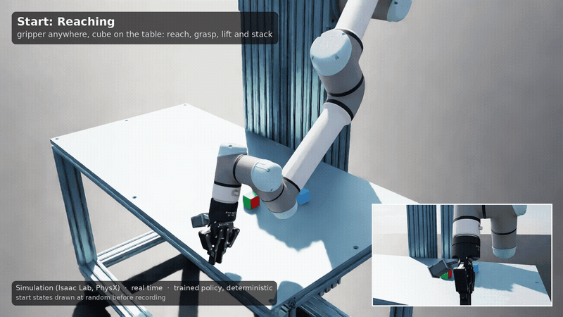
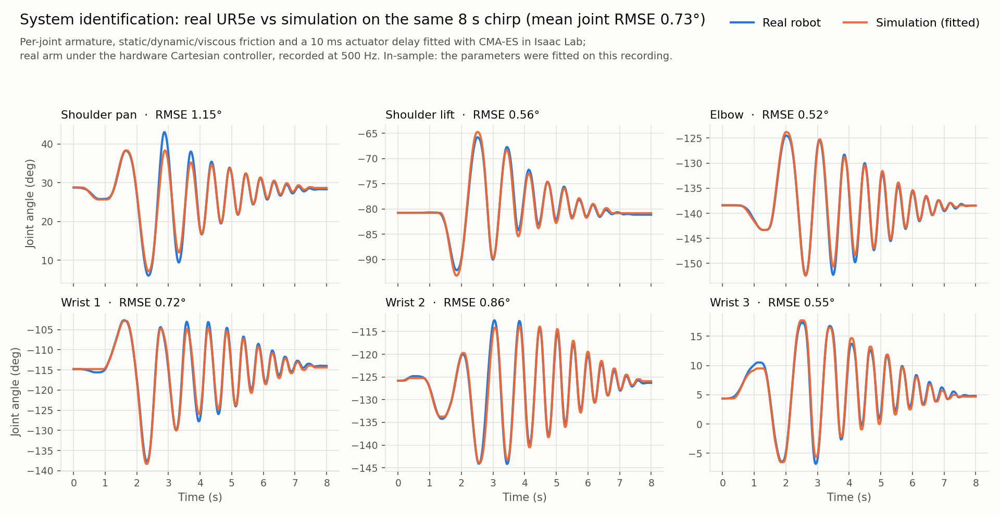
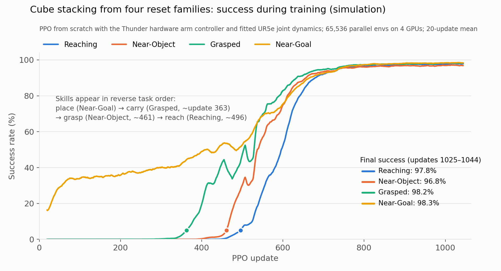

# Thunder: sim-to-real RL for cube stacking

This fork adapts UW Lab's [OmniReset](https://uw-lab.github.io/UWLab/main/source/publications/omnireset/index.html)
to **Thunder**, a sideways-mounted UR5e with a Robotiq 2F-85 gripper and a RealSense D405 wrist camera at the
[RPM Lab](https://rpm-lab.github.io/), University of Minnesota. OmniReset (reinforcement learning from diverse reset states),
the task code and the training stack are UW Lab's work. This section summarizes my adaptation to our robot and where it stands.

**Status:** policies are trained in simulation; deploying them on the real robot is in progress.

| Real robot: system-identification run | Simulation: trained policy, real time |
| --- | --- |
|  |  |
| [Video with sound](docs/thunder/media/real_robot_sysid_chirp.mp4) | [All nine recorded episodes](docs/thunder/media/sim_policy_rollouts.mp4) |

### 1. Real-robot system identification

- **Excitation:** UW Lab's 8 s Cartesian chirp (0.1 to 3 Hz), remapped to Thunder's sideways mount and started from a pose
  chosen for clearance. The arm runs the same Cartesian impedance gains used on hardware (Kp 1000 / 50).
- **Data collection:** earlier recordings had 42 to 82 duplicate robot timestamps per run because the loop was paced by the host
  clock. I changed the collector to step on each fresh robot state. The recording used here has no duplicate, late or
  out-of-order samples at 500 Hz.
- **Fit:** a CMA-ES fit in Isaac Lab, following UW Lab's system-identification method, estimates each joint's motor armature,
  static, dynamic and viscous friction, plus an actuator delay (10 ms). The simulated arm tracks the real one with a **0.73° mean joint-angle RMSE** (0.52 to 1.15°
  per joint). The parameters were fitted on this same recording, so this is in-sample agreement.
- **Hardware:** the gripper carries my [UMI-style TPU fingers](https://github.com/sri299792458/robotiq-2f85-umi-gripper) and
  [D405 wrist mount](https://github.com/sri299792458/robotiq-2f85-d405-mount), designed and 3D-printed for this robot.

### 2. Training in simulation with the identified model

- PPO (RSL-RL) from scratch with the hardware controller gains and the identified joint model in the loop (the 10 ms delay
  becomes one 8.3 ms physics step at 120 Hz). Upstream trains with softer gains first and fine-tunes toward the hardware; this
  run trains with the hardware controller directly.
- 65,536 parallel environments on 4 RTX A6000 GPUs; 1,044 PPO updates (2.2 billion environment steps, 9.5 hours).
- Success reached **97 to 98% from all four OmniReset reset families**. Competence grew backward through the task: placing first,
  then carrying, grasping and finally reaching from anywhere.
- Recorded rollouts: **12 of 12** start states drawn at random before recording (3 per family) ended stacked; nine are in the video.
  These runs use the stock Robotiq pads; training with the UMI fingertips is still in progress (see below).

### 3. Problems found and fixed along the way

- **Action axes on a sideways mount.** Policy actions are expressed in the robot base frame, so on Thunder the large
  rotation-action scale landed on a horizontal tilt instead of the vertical axis. Moving it to the correct axis fixed the mismatch.
- **Lost "cube in hand" resets.** With compliant gains in the reset-generation settle, almost all held-cube start states dropped
  their cube (2% kept, versus 73% in a working bank). Generating them under the hardware controller restored them, after which
  runs with the official Robotiq hand began to learn.
- **Wrist singularity in start postures.** The inherited reset posture put the second wrist joint near the UR wrist singularity
  in about half of the start states. I chose the closed-form UR5e inverse-kinematics branch that stays clear of it over the most
  workspace and seeded all resets with it.
- **Exploration noise.** Upstream's newer state-dependent noise distribution slowed or stalled learning in both setups I tested
  (controlled single-seed comparisons), so I kept the original one.
- **Gripper contact model (open).** In simulation, the UMI fingertips lose held cubes 3 to 4 times as often as the stock pads
  under training randomization. The official Robotiq drive's actual squeeze varies sharply with the randomized gains, and the
  stronger squeezes eject cubes that the UMI fingers hold at an angle across their corners.

### 4. Next steps

- Deploy the trained policy on Thunder.
- Train with the UMI fingertips once the gripper contact model is fixed.
- Extend to the whole reachable table region with 60 mm cubes (the reachability map is built).

**Credits:** OmniReset and the UW Lab framework ([UW-Lab/UWLab](https://github.com/UW-Lab/UWLab)); NVIDIA Isaac Lab and
Isaac Sim; RSL-RL; Robotiq's official 2F-85 simulation asset; the open UMI gripper design. Author of this fork's Thunder work:
[Srinivas Kantha Reddy](https://github.com/sri299792458).

---

*The original UW Lab README follows, unchanged.*

# UW Lab

## Overview

UW Lab builds upon the robust foundation established by Isaac Lab and NVIDIA Isaac Sim, expanding its framework to integrate a wider range of robotics algorithms, platforms, and environments. Rooted in principles of modularity, agility, openness, and a battery-included design inspired from IsaacLab, our framework is crafted to meet the evolving demands of modern robotics research.

In the short term, our mission is to consolidate and streamline robotics research into one cohesive ecosystem, empowering researchers and developers with a unified platform. Looking ahead, UW Lab envisions a future where artificial intelligence and robotics coalesce seamlessly with physical systems—bridging the gap between simulation and real-world application. By embedding the laws of physics at its core, our framework provides a realistic, adaptable platform for developing next-generation robotic systems.

At UW Lab, we believe that the development journey is as significant as the outcome. Our commitment to creating principled, flexible, and extensible structures supports an environment where innovation thrives and every experiment contributes to advancing the field of robotics. Join us as we push the boundaries of what's possible, transforming ideas into tangible, intelligent robotic solutions.

## Key Features

In addition to what IsaacLab provides, UW Lab brings:

- **Environments**: Cleaned Implementation of reputable environments in Manager-Based format
- **Sim to Real**: Providing robots and configuration that has been tested in Lab and deliver the Simulation Setup that can directly transfer to reals

## Installation

Follow the [installation guide](https://uw-lab.github.io/UWLab/main/source/setup/installation/index.html).

## Getting Started

- **Train Your First Policy** — Train an ant to run in minutes → [Quickstart](https://uw-lab.github.io/UWLab/main/source/setup/installation/pip_installation.html#train-a-robot)
- **OmniReset** — RL for manipulation without reward engineering or demos → [Quickstart](https://uw-lab.github.io/UWLab/main/source/publications/omnireset/index.html#quick-start)

See [all available environments](https://uw-lab.github.io/UWLab/main/source/overview/uw_environments.html) and [full documentation](https://uw-lab.github.io/UWLab) for details.

## Support

* Please use GitHub [Discussions](https://github.com/uw-lab/UWLab/discussions) for discussing ideas, asking questions, and requests for new features.
* Github [Issues](https://github.com/uw-lab/UWLab/issues) should only be used to track executable pieces of work with a definite scope and a clear deliverable. These can be fixing bugs, documentation issues, new features, or general updates.

## License

UW Lab is released under [BSD-3 License](LICENSE)
The Isaac Lab framework is released under [BSD-3 License](LICENSE).
