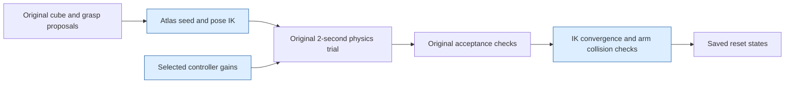

# Changes for regenerating UMI resets with the accepted map

## September 17 physical mounting correction and 20 mm map

The active Thunder mounting quaternion is now `[0.5, 0.5, 0.5, 0.5]` in `w,x,y,z` order.
The map was recomputed at **20 mm XYZ spacing**, as requested: 31 heights, 37 Y positions,
75 X positions and the same 504 orientations. It contains 13,259,706 accepted pose solutions
across 60,276 spatial positions. The root translation, calibrated joint transforms and
controller-frame conversion are preserved. See [the mounting record](scripts_v2/tools/thunder_sim2real/MOUNTING_CORRECTION.md).

The active data root is `/data/kanth042/datasets/thunder_mount_corrected_20mm_20260917`.
Full-arm reset banks are regenerated there and validated against the corrected geometry.
The 591 object-relative grasps and 5,536 partial-assembly records are reused. Sphere geometry,
clearance rules, sampling intent, original acceptance, rewards and controller gains keep the
previously reviewed definitions. The current placement test preserves all 512 sampled hand
angles, including 210 that a nearest-orientation test would have rejected.

The earlier data root and training run are historical inputs, separate from this revision.
Use the current data root's `dataset_audit.json` and `native_validation.json` for final bank
identities; the entries below describe earlier revisions.

## Earlier September 17 behavior after recipe review

The user's criterion is to preserve what each default UWLab reset recipe intends, while adapting its workspace to the selected hardware and requested clearances.

- Map: exactly 10 mm XYZ spacing, heights 0–600 mm, 504 orientations and 32 IK seeds per target. X's physical 1.485 m extent leaves 5 mm beyond the last regularly spaced sample. The original raw 239-sphere fit is retained.
- Geometry: 50 mm from moving robot sphere surfaces to the eight vertical column boxes; 1 mm to other world geometry; 2 mm combined self-pair padding; original exclusions and fixed-base mounting exception. The native final-state check uses actual finger poses and mount perturbation.
- Table edges: 50 mm from the rotated 60 mm cube bounding footprint. This conservatively ignores rounded corners. The user explicitly retained this boundary rule after discussing a 50 mm center rule.
- Free-hand proposals: choose continuous positions with at least one mapped arm orientation, then try independently sampled original hand angles. There is no rejection based on the nearest mapped orientation. Tool positions are converted to gripper-base targets using the rotated 169.122 mm offset.
- Cube proposals: draw upstream Z, orientation and velocity once; rejection relocates only XY. A cube center is an approximate workspace reference, not an exact grasp certificate. For general free-object placements the location query uses the nominal resting-center height (30 mm above the table); airborne placements use their sampled center height; lower-cube locations use the stacked upper-cube center derived from metadata. Position coverage requires some recorded arm orientation, independently of the sampled cube orientation.
- No cube-pose or settled-cube rejection uses the grasp library. That short-lived addition was removed after the user's recipe review because it excluded cube faces absent from the finite grasp file. Grasped recipes continue to choose and test grasps through upstream code.
- Initial IK errors remain diagnostic; the additional 1 mm / 0.01 rad reset rejection is removed. Original physics acceptance is followed by final robot geometry and cube-edge checks. The extra airborne 10 mm support rule is removed.
- All offline generation uses authored 100 g cube mass and inertia. Training retains its existing 20–200 g mass randomization and fixed lower cube.

The policy outputs Cartesian hand changes and a gripper command, not arm joint angles. The map's initial-arm-configuration distribution differs from the earlier bank; its causal effect on learning has not been isolated. Its selection is retained, along with the previously disclosed 25 free-hand IK updates and selected controller gains.

Validation of the corrected sampler: 512 random footprint cases, six explicit boundary cases and 512 position-coverage cases matched independent calculations. All 512 hand-angle draws survived position selection, including 184 absent from the nearest orientation sample in the old-map fixture. The native integration test preserved sampled Z/quaternions in 4,106 cube resets and produced 608 general states containing all six upward cube faces. These tests use the previous map as a fixture; the replacement bank will use the new map.

The earlier orientation-dependent implementation passed mathematical/execution checks but failed the intended-recipe review. Its source is preserved in `49_clearance_and_placement/before_orientation_correction`; its four small test banks are isolated in `integration_fixture` and will not feed the replacement bank.

[Current artifacts and source records](/data/kanth042/datasets/umi_reset_from_defaults_20260911/49_clearance_and_placement/README.md). The new map and 40,732-state replacement bank are complete. Every retained state passed native reload, finite/uniqueness, robot geometry and cube-edge checks; one airborne row failing the existing 50 mm rule was archived and excluded. All ten original physics/controller checks passed. The separate task-1 probe lifted 0/256 cubes despite all 256 hands rising. Retained grip is not an upstream acceptance requirement: May's scripted lift raised only 10/256 table-start cubes, yet its learned policy completed 249/256 task-1 episodes. This diagnostic is not a new validation failure or readiness requirement. The bank is staged while training remains paused.

## September 14 source update: recipe 0 free-hand proposals

Recipe 0 now draws continuous tool-point positions within the recorded map's
domain: its table X/Y extent and 2–60 cm above the tabletop. It retains stock's
world-frame gripper-base orientation proposals (roll 0, pitch 45–135 degrees,
yaw 90–270 degrees) before coverage rejection.

For each candidate, the sampler converts the hand orientation to the map's
`umi_grasp_center` orientation and checks the nearest grid position and nearest
orientation. An uncovered entry triggers another proposal. This coverage screen
does not substitute a different occupied position or orientation. Positions and
orientations remain continuous; the map is a finite coverage screen, not proof
that the exact candidate is reachable or collision-free.

The approximately 169.122 mm tool offset is rotated by the sampled hand
orientation and subtracted from the tool position to obtain the gripper-base
target. The map is anchored to the lab scene. Environment origins and the actual
robot root, including root perturbation, are accounted for when forming the IK
command. The existing atlas seed, 25 partial IK updates, exact-target check, and
two-second physics acceptance remain in place.

Cube placement and recipes 1–3 retain their previous behavior. Their hand targets
still come from cube pose, saved grasp, and configured perturbation. Training
continues to restore saved states. Existing production datasets were not replaced;
the small verification bank is separate.

The complete change and validation record is in
[/data/kanth042/datasets/umi_reset_from_defaults_20260911/40_map_free_hand_sampling](/data/kanth042/datasets/umi_reset_from_defaults_20260911/40_map_free_hand_sampling/README.md).
The mass restorations are documented in [the training guide](umi_default_pipeline_training.md).

## September 12 recorded generation

This describes changes relative to the UMI reset configuration immediately before
the September 12 regeneration work. It does not describe the older hardware,
gripper-reference, or released-stack reward adaptations as new changes.

The blue boxes identify the changed parts. IK convergence is measured immediately
after positioning the arm and retained for the final acceptance decision.

| Part | Before | Regeneration configuration | Reason |
|---|---|---|---|
| Arm gains | Upstream reset defaults: translation Kp 200, damping ratio 3; rotation Kp 3, ratio 1 | Translation Kp 500, Kd 160; rotation Kp 60, Kd 0.1 | Generate under the controller selected in the lift/carry/release trials. |
| Initial arm angles for IK | Current/default arm posture | Nearest occupied atlas XYZ cell, then closest available orientation | Use the accepted map to initialize the same pose solver. The sampled target is retained. |
| Free-hand IK updates | 10 updates, each applying 25% of the computed joint displacement | 25 updates, still applying 25% | Allow the nearby map seed to converge to the continuous sampled pose. The grasped families already use 25. |
| IK convergence acceptance | No explicit target-pose convergence filter | Position error at most 1 mm and rotation error at most 0.01 rad, measured immediately after reset IK | These tolerances match the atlas. A nearby seed alone does not establish that the requested grasp pose was reached. |
| Final arm collision acceptance | Existing robot/cube and cube/cube checks | Existing checks plus the accepted sphere model against robot links and lab boxes | Reject final states that collide with the lab or other arm links. |
| Data inputs/output | Previously generated banks | Fresh grasps, partial assemblies, and four reset families in a separate directory | Avoid mixing states generated before the current gripper reference, map, and gains. |

The gain configuration uses the existing formula `Kd = 2 * sqrt(Kp) * damping_ratio`.
No controller dynamics or integration code was changed in this work. Physics stays
at 120 Hz, decimation at 12, and each reset trial lasts 2 seconds.

The map lookup and additional acceptance checks run while generating the bank.
PPO training loads the resulting saved states through the existing reset manager;
this integration does not add a map or sphere query to each policy step.

The original code continues to choose cube poses, grasp-library entries, grasp
depths and orientations, and pose perturbations. The map provides a seed; the
original target is not snapped to the grid. Cube masses, friction, restitution,
contact settings, gripper controller, stability thresholds, and existing airborne
support-clearance check remain unchanged.

Task placement bounds remain X `[-0.11708964407444, 0.6501603722572327]` and Y
`[-0.4083046615123749, 0.28769537806510925]` metres in lab coordinates. An initial
full-table expansion and coarse cube-location filter were removed before production
generation. The early pilots using those settings are kept separately and are not
training inputs.

The sphere adapter reads the same 239 spheres, adds the same 1 mm radius padding,
retains the same self-pair exclusions and fixed-base world omission, and checks the
same 33 lab boxes. It evaluates sphere centers using Isaac Sim's actual body poses,
including current finger positions and robot-base jitter. It matched cuRobo's
self/world classifications on 2,048 open-hand configurations with zero disagreements.
This retains the accepted sphere approximation and its limitations; it does not
establish new accuracy for internal gripper pairs, which the model excludes.

Implementation is isolated to the UMI configuration and two adapter modules:

- `umi_reset_cfg.py` selects gains and the map reset event/acceptance classes.
- `umi_training_cfg.py` shares the same gain helper; its training bank is switched only after regeneration validates.
- `mdp/umi_map_reset.py` wraps the original samplers and adds seed/convergence logic.
- `mdp/umi_sphere_geometry.py` evaluates the accepted collision geometry.
- `scripts_v2/tools/map_reset/` packs the atlas, checks numerical equivalence, and runs/archives the existing recorders.

The upstream event implementations, upstream reset configuration, controller,
recorders, source robot asset, and cube assets were not edited for this integration.

The full native reload audit rejected two resting rows that had passed recording.
An independent float64 calculation put them 0.050 mm and 0.0024 mm inside the
already padded sphere model. They were removed using the same collision criterion;
no collision tolerance or sampling range was changed. The final bank contains
41,036 states, and all of them pass the native reload collision check. The original
rows and exclusion record are preserved in the regeneration output directory.
